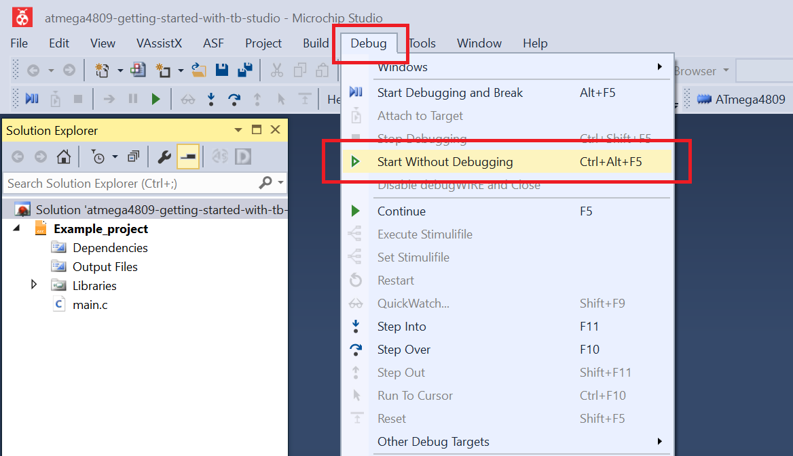

<!-- Please do not change this logo with link -->

# ADC Sample Accumulator

This example demonstrates how to use the sample accumulation function of the ADC to obtain better results that are not affected by noise. The example accumulates 64 samples. The conversion result is represented by the accumulated value divided by 64.

## Related Documentation
More details and code examples on the ATMEGA4809 can be found at the following links:
- [TB3209 - Getting Started with Analog to Digital Converter (ADC)](http://ww1.microchip.com/downloads/en/Appnotes/TB3209-Getting-Started-with-ADC-90003209A.pdf)
- [ATMEGA4809 Product Page](https://www.microchip.com/wwwproducts/en/ATMEGA4809)
- [ATMEGA4809 Code Examples on GitHub](https://github.com/microchip-pic-avr-examples?q=atmega4809)
- [ATMEGA4809 Project Examples in START](https://start.atmel.com/#examples/ATMEGA4809XplainedPro)

## Software Used
- Microchip Studio 7.0.2542 or newer [(https://www.microchip.com/mplab/microchip-studio)](https://www.microchip.com/mplab/microchip-studio)
- ATmega_DFP 1.5.362 or newer Device Pack

## Hardware Used
- ATMEGA4809 Xplained Pro [(ATMEGA4809-XPRO)](https://www.microchip.com/developmenttools/ProductDetails/ATMEGA4809-XPRO)

## Setup
The ATMEGA4809 Xplained Pro Development Board is used as test platform.

 

The following configurations must be made for this project:

- The CPU frequency is 3.33 MHz.
- The ADC is configured in the following way:
  - Internal reference.
  - Peripheral clock divided by 4 as clock source.
  - 10 bit resolution.
  - Pin PD6 (analog channel 6) chosen as input.
  - Sample accumulator set for 64 samples.
- Pin PD6 has input buffer and pull-up disabled. 

 |Pin                       | Configuration      |
 | :---------------------:  | :----------------: |
 |      PD6 (AIN6)          | Analog input       |

 ## Operation
 1. Connect the board to the PC.

 2. Open the **atmega4809-getting-started-with-adc-studio.atsln** solution in Microchip Studio.

 3. Set the **Sample_Accumulator** project as Start-Up project. Right click on the project in the **Solution Explorer** tab and click **Set as StartUp Project**.

 

 4. Build the **Sample_Accumulator** project: Right click on the **atmega4809-getting-started-with-adc-studio** solution and select **Build Solution**.

 

 5. Select the **ATMEGA4809 Xplained Pro** in the Connected Hardware Tool section of the project settings:
   - Right click on the project and click **Properties**
   - Click on the **Tool** tab
   - Select the ATMEGA4809 Xplained Pro (click on the **SN**) in the **Selected debugger/programmer** section and Save (CTRL + S):

 

 6. Program the project to the board: Click on the **Debug** tab and click **Start Without Debugging**.

 

## Summary

This project shows how to use the ADC in the Sample Accumulator mode to reduce the noise influence on the result.
