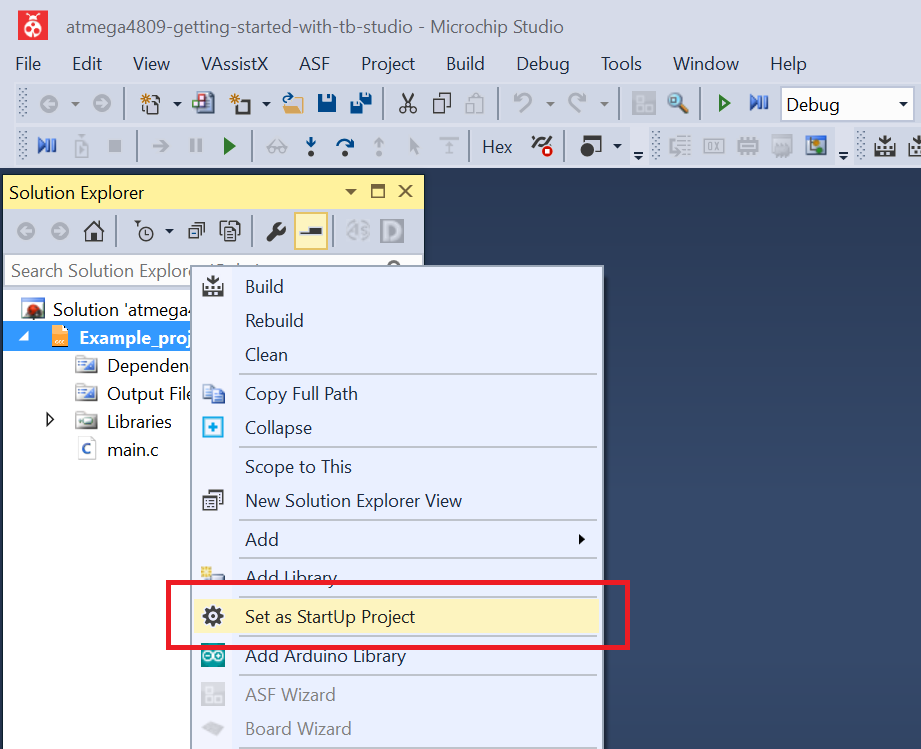
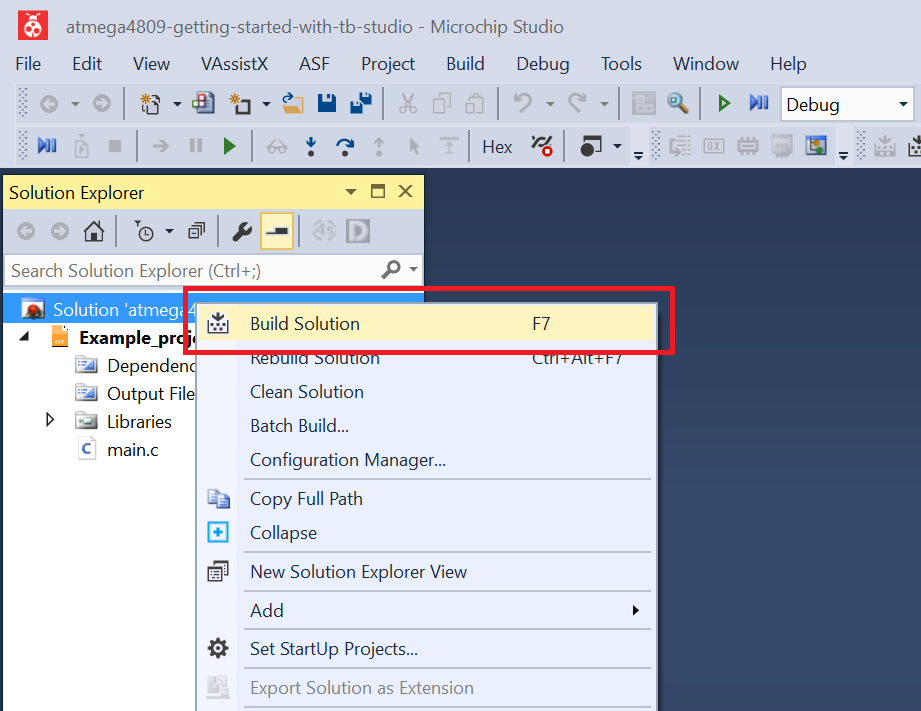
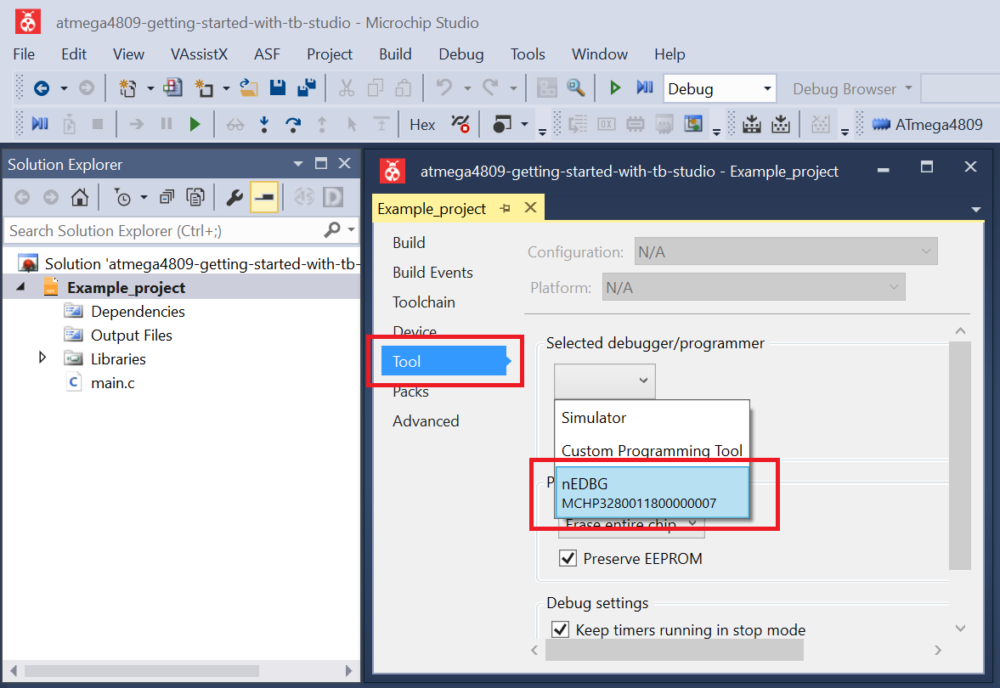
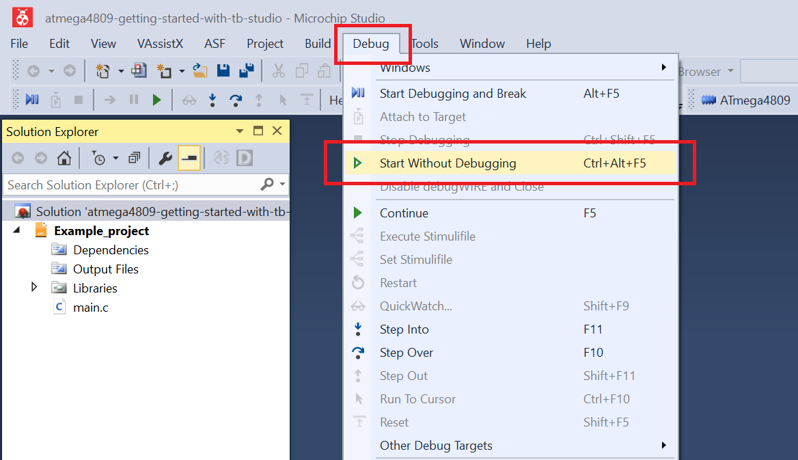

<!-- Please do not change this logo with link -->

 # ADC Window Comparator - Use Case for the ATmega4809 Microcontroller with Microchip Studio

This example uses the ADC in Window Comparator mode, where the device can detect if the ADC result is below or above a specific threshold value. This is useful when monitoring a signal that is required to be maintained in a specific range, or for signaling low battery/overcharge, etc. The Window Comparator is used in Free-Running mode, because a monitored signal requires continuous sampling, and the Free-Running mode reduces the CPU load by not requiring manual start for each conversion.

## Related Documentation
More details and code examples on the ATMEGA4809 can be found at the following links:
- [TB3209-Getting Started with Analog-to-Digital Converter (ADC)](https://ww1.microchip.com/downloads/en/Appnotes/TB3209-Getting-Started-with-ADC-DS90003209.pdf)
- [ATMEGA4809 Product Page](https://www.microchip.com/wwwproducts/en/ATMEGA4809)
- [ATMEGA4809 Code Examples on GitHub](https://github.com/microchip-pic-avr-examples?q=atmega4809)
- [ATMEGA4809 Project Examples in START](https://start.atmel.com/#examples/ATMEGA4809XplainedPro)

## Software Used
- Microchip Studio 7.0.2594 or newer [(https://www.microchip.com/mplab/microchip-studio)](https://www.microchip.com/mplab/microchip-studio)
- ATmega_DFP 2.1.506 or newer Device Pack

## Hardware Used
- ATMEGA4809 Xplained Pro [(ATMEGA4809-XPRO)](https://www.microchip.com/developmenttools/ProductDetails/ATMEGA4809-XPRO)

## Setup
The ATMEGA4809 Xplained Pro development board is used as test platform.

 

The following configurations must be made for this project:

- The CPU frequency is 3.33 MHz
- Configure pin PD6 as input, ADC input channel, and disable the digital input buffer and the pull-up resistor
- ADC configuration: Window mode and Free-Running, 10-bit mode, use internal voltage reference and peripheral clock divided by four as clock source, set the conversion window comparator low threshold (a value of `0x100` defined as `WINDOW_CMP_LOW_TH_EXAMPLE`)
- Configure pin PB5 as output and with initial value HIGH. This pin will be used by the on-board LED and the initial value HIGH represents LED OFF

 |Pin                       | Configuration      |
 | :---------------------:  | :----------------: |
 |            PB5           |   Digital output   |
 |            PD6           |   Analog input     |

 ## Operation
 1. Connect the board to the PC.

 2. Open the **atmega4809-getting-started-with-adc-studio.atsln** solution in Microchip Studio.

 3. Set the **Window_Comparator** project as Start-Up project. Right click the project in the **Solution Explorer** tab and click **Set as StartUp Project**.

 

 4. Build the **Window_Comparator** project: Right click the **atmega4809-getting-started-with-adc-studio** solution and select **Build Solution**.

 

 5. Select the **ATMEGA4809 Xplained Pro** in the Connected Hardware Tool section of the project settings:
   - Right click the project and click **Properties**
   - Click the **Tool** tab
   - Select the ATMEGA4809 Xplained Pro (click on the **SN**) in the **Selected debugger/programmer** section and Save (CTRL + S):

 

 6. Program the project to the board: click the **Debug** tab and Click **Start Without Debugging**.

 

## Summary

This project shows how to configure the ADC peripheral in Window Comparator mode. In this mode, the microcontroller (MCU) detects if the ADC result is below or above a specific threshold value.
